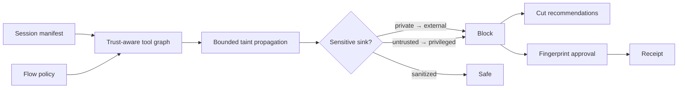

# TaintWeave

**A cross-server information-flow compiler for MCP agent sessions.**

An email reader may be harmless. A vault reader may be justified. A message
sender may be useful. Install all three in one AI session and they form a route
from attacker-controlled instructions to private data and external
communication.

TaintWeave analyzes that composition before tools are exposed to an agent. It
builds a trust-aware graph, propagates declared data classes across compatible
tools, detects sensitive sinks, and produces fingerprint-bound findings and
tamper-evident receipts.



## What is different

Most scanners examine one server, package, or tool. TaintWeave evaluates the
session as a system. A finding contains the exact multi-tool path, data classes,
trust-boundary crossings, severity, stable fingerprint, and concrete ways to
break the route.

It detects:

- Session-level private data + untrusted content + external communication
  combinations
- Sensitive data reaching external-send tools
- Untrusted content reaching code execution or destructive tools
- Sensitive data crossing server trust zones
- Privileged tools exposed by untrusted servers
- Tools that declare mandatory human approval
- Incomplete analysis caused by path or finding budgets

Declared sanitizers remove specific taints. All other transforms preserve
incoming taint conservatively.

## Quick start

Requirements: Node.js 20+ and pnpm 10.14+.

```bash
pnpm install
pnpm check

pnpm weave analyze examples/safe-session.json \
  --policy examples/safe-policy.json \
  --at 2026-07-29T09:00:00.000Z

pnpm weave analyze examples/risky-session.json \
  --policy examples/risky-policy.json \
  --at 2026-07-29T09:00:00.000Z
```

The safe example exits with `0`. The risky five-server session exits with `2`.

## CLI

```text
taint-weave inspect <manifest.json> [--json]
taint-weave analyze <manifest.json> --policy <policy.json> [--json]
taint-weave graph <manifest.json> --policy <policy.json> [--dot]
taint-weave explain <manifest.json> --policy <policy.json> --finding <id>
taint-weave cuts <manifest.json> --policy <policy.json>
taint-weave receipt <manifest.json> --policy <policy.json> --output <receipt.json>
taint-weave verify <receipt.json> [--manifest <json>] [--policy <json>]
taint-weave demo [safe|risky]
taint-weave init [directory]
```

Exit codes: `0` safe or valid, `2` blocked, `3` review required, and `5`
invalid input.

Export a Graphviz topology:

```bash
pnpm weave graph examples/risky-session.json \
  --policy examples/risky-policy.json \
  --dot > session.dot
```

## Tool profiles

Each tool declares:

- `consumes`: accepted data classes;
- `produces`: originated data classes;
- `sanitizes`: incoming classes removed by a trusted transformation;
- `capabilities`: behavioral roles such as `private-read`, `external-send`,
  `execute-code`, or `destructive`;
- `requiresHumanApproval`: whether the tool itself demands an approval gate.

Data classes are `public`, `internal`, `personal`, `confidential`, `credential`,
`untrusted`, and `any`. See [MANIFEST.md](docs/MANIFEST.md).

## Analysis model

TaintWeave begins at every tool producing a sensitive or untrusted class. It
performs bounded breadth-first propagation through compatible consumers.
Incoming taint survives transforms unless the next tool explicitly sanitizes
that class.

This is intentionally conservative. It is better at answering “can this
composition create a dangerous route?” than proving which route an LLM will
choose.

The engine deduplicates equivalent source-to-sink findings, caps state
exploration, and refuses to issue a receipt when analysis was truncated.

## Review and receipts

Every finding ID is derived from its rule, severity, exact path, data classes,
boundary state, and remediation. Add an accepted ID to `policy.approvals`; any
path change creates a new fingerprint.

Only safe, complete analyses can produce a receipt:

```bash
pnpm weave receipt examples/safe-session.json \
  --policy examples/safe-policy.json \
  --output flow-receipt.json

pnpm weave verify flow-receipt.json \
  --manifest examples/safe-session.json \
  --policy examples/safe-policy.json
```

## Studio

```bash
pnpm dev
```

The browser studio visualizes tools by trust zone, their input/output classes,
compiled source-to-sink paths, severity filters, session score, and downloadable
reports. It includes safe and adversarial scenarios and runs entirely locally.

## Why this exists

The MCP project notes that combining tools changes the risk profile of the
whole session and that cross-server tool results are untrusted input. Recent
research also measures cross-boundary propagation in multi-server MCP agents:

- [MCP Tool Annotations: Why Combinations Matter](https://blog.modelcontextprotocol.io/posts/2026-03-16-tool-annotations/)
- [MCP Client Best Practices](https://modelcontextprotocol.io/docs/develop/clients/client-best-practices)
- [MCPHunt: Cross-Boundary Data Propagation](https://arxiv.org/abs/2604.27819)
- [Breaking the Protocol: Multi-Server Trust Propagation](https://arxiv.org/abs/2601.17549)

## Security boundary

Profiles are declarations and can be wrong. TaintWeave does not execute tools,
inspect server implementations, or prove runtime non-interference. Generate
profiles through a trusted review process and combine this gate with sandboxing,
least-privilege authorization, runtime tracing, and explicit user confirmation.
Read [THREAT-MODEL.md](docs/THREAT-MODEL.md).

## Repository layout

```text
packages/core    graph construction, taint propagation, policy, receipts
packages/cli     automation and Graphviz export
apps/studio      interactive trust-zone and route inspector
examples         safe and adversarial multi-server sessions
docs             manifest, policy, integration, and threat model
```

## License

[MIT](LICENSE)
